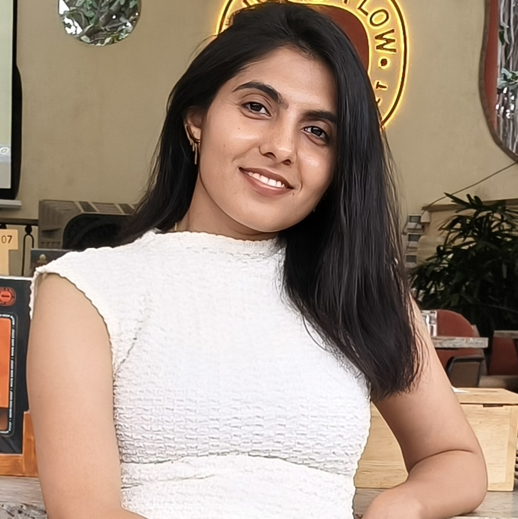

<!DOCTYPE html>
<html lang="en">
<head>
  <meta charset="UTF-8">
  <meta name="viewport" content="width=device-width, initial-scale=1.0">
  <title>Arzoo Portfolio</title>
  
</head>
<body>
  

    <!-- TOP SECTION -->
    

      

        <h1 class="hero-name">Arzoo</h1>
        <h2 class="hero-designation">Data Analyst at Vaibhav Vyapaar Pvt. Ltd.</h2>

        

          

          
        

      

      

        
      

    

    

    <!-- EDUCATION -->
    <h2 class="section-title">Education</h2>
    

    <table>
      <tr>
        <td><strong>B.Tech</strong></td>
        <td><strong>IIT Guwahati</strong></td>
        <td><strong>Chemical Engineering</strong></td>
        <td><strong>7.75</strong></td>
      </tr>
      <tr>
        <td><strong>M.Tech</strong></td>
        <td><strong>IIT Kanpur</strong></td>
        <td><strong>Chemical Engineering</strong></td>
        <td><strong>9.67</strong></td>
      </tr>
    </table>

    <!-- WORK EXPERIENCE -->
    

      <h2>Work Experience at Galaxy Surfactants Ltd.</h2>
      
    

    

    
Trainee Plant Engineer (Sept-2020 to Sept-2021)

    
Plant Officer (Sept-2021 to May-2023)

    
Senior Plant Officer (May-2023 to Oct-2023)

    <ul>
      <li>Reduced operational cost by washing 2 dryers simultaneously using hot water with savings of 10.54 Lakhs/annum and reduced HIRA score from 384 to 64</li>
      <li>Modified the caustic-dosing system for dryer washing which reduced the HIRA score of the activity from 144 to 36 with savings of 2 Lakhs/annum</li>
      <li>Reduced packing cost by 2.8 Lakhs/annum by changing bag dimensions</li>
      <li>Installed camlock coupling in tanker unloading line which won 2nd prize (Jury Championship) in CII Kaizen competition</li>
      <li>Budgeted, monitored & analysed variable overheads (Power & Fuel) of the drying plant</li>
    </ul>

    

    <!-- CERTIFICATIONS -->
    <h2 class="section-title">Certifications</h2>
    

    <table class="cert-table">
      <tr>
        <th colspan="5">Skill Certificates</th>
      </tr>
      <tr>
        <td>
          
           
          <a href="https://moonshot.scaler.com/s/sl/S5H5tOyZM3" target="_blank">Python Libraries</a>
        </td>
        <td>
          
           
          <a href="https://moonshot.scaler.com/s/sl/UbvSt91s1H" target="_blank">SQL</a>
        </td>
        <td>
          
           
          <a href="https://moonshot.scaler.com/s/sl/2KNZRl4RqV" target="_blank">EDA</a>
        </td>
        <td>
          
           
          <a href="https://moonshot.scaler.com/s/li/rKD3Tz8_ne" target="_blank">ML: Supervised Learning</a>
        </td>
        <td>
          
           
          <a href="https://moonshot.scaler.com/s/li/RigosLjVUB" target="_blank">ML: Unsupervised Learning</a>
        </td>
      </tr>
    </table>

    

    <!-- PROJECTS -->
    <h2 class="section-title">Projects</h2>
    

    

      <h3><a href="https://github.com/azbaloda/SQL_Target_Analysis" target="_blank">Project 1: Target Business Analysis using SQL</a></h3>
      <ul>
        <li>Utilized BigQuery for systematic uploading and management of 8 datasets with about 100,000 orders.</li>
        <li>Performed SQL analysis on month-on-month orders, customer distribution, money movement, delivery time, and payments.</li>
        <li>Formulated actionable insights to improve operational efficiency and business strategy.</li>
      </ul>
    

    

      <h3><a href="https://github.com/azbaloda/Netflix-Data-Exploration-and-Visualisation" target="_blank">Project 2: Netflix Data Exploration</a></h3>
      <ul>
        <li>Analyzed over 10,000 Movies and TV Shows available on Netflix.</li>
        <li>Used NumPy, Pandas, Matplotlib, and Seaborn for analysis and visualization.</li>
        <li>Performed preprocessing including missing value treatment, duplicate removal, and outlier handling.</li>
        <li>Created 8 plot types including bar, pie, count, dist, box, kde, heatmap, and pairplot.</li>
      </ul>
    

    

      <h3><a href="https://github.com/azbaloda/Jamboree-Education---Linear-Regression" target="_blank">Project 3: Jamboree Linear Regression</a></h3>
      <ul>
        <li>Analyzed student data to identify key factors affecting graduate admissions.</li>
        <li>Built a Linear Regression model with Adjusted R² of 0.82.</li>
        <li>Recommended improvement areas such as CGPA, research, LOR, and SOP.</li>
      </ul>
    

    

      <h3><a href="https://public.tableau.com/app/profile/arzoo.baloda/viz/SalesCustomerDashboards_17120333759470/SalesDashboard?publish=yes" target="_blank">Project 4: Tableau Dashboard - Sales & Customer</a></h3>
      <ul>
        <li>Built 2 dashboards for Sales and Customer analysis.</li>
        <li>Analyzed year-over-year sales performance and customer behavior.</li>
        <li>Added interactive filters by category, sub-category, region, state, and city.</li>
      </ul>
    

  

</body>
</html>
